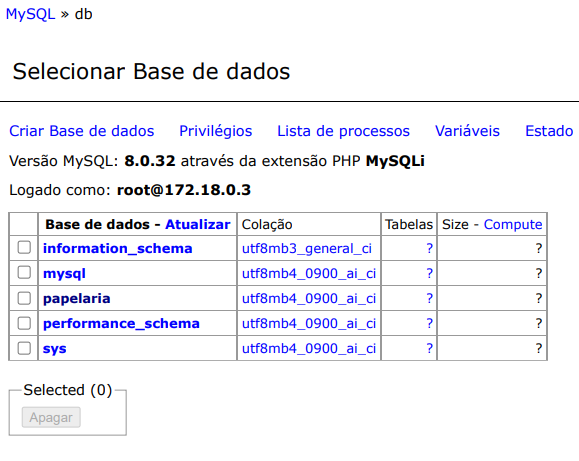

# Documentação
## Banco de dados mysql 

-Primeiro intalamos o ubuntu server

- Daremos o comando sudo apt update && sudo apt upgrade, para executar e atualizar os pacotes listados pelo sistema

- Instalamos o Docker com o seguinte comando
"sudo apt install docker" 

- Instalação do Docker compose "sudo apt install docker-copose"

- Instalamos o cockpit para ter acesso via navegador 

- Criaremos um arquivo chamado vim docker-compose.yml

- Iremos subir o codigo que foi escrito via vscode

- Daremos o comando docker-compose up para rodar a aplicação

- Direcionaremos na VM  as portas das seguintes ferramentas (WordPress e Adminer)

- Acessaremos o Adminer para criar as tabelas

- Acessaremos o wordpress para criar o site 

- Vamos escolher um tema no WordPress para começar a execução do site 

- Depois faremos no tema que vc escolher as alterações necessárias
